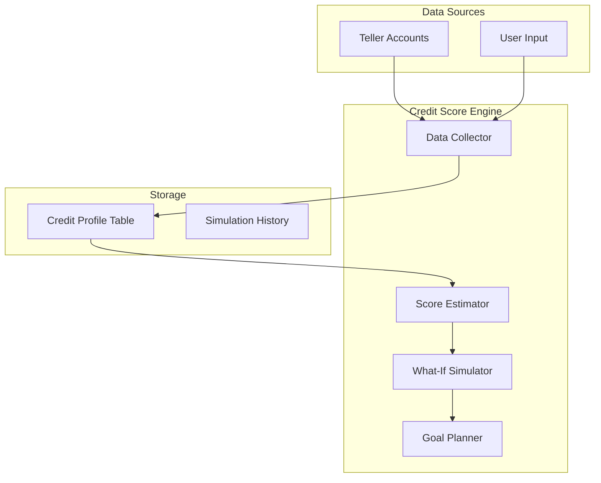

# Credit Score Simulator

## Overview

Build a privacy-first credit score simulator that:
1. Estimates user's current credit score using data from Teller-connected accounts
2. Provides interactive "what-if" simulation for credit actions
3. Generates personalized action plans to reach target scores (e.g., "Get me to 800+")

Key differentiator: All calculations happen locally - no external credit bureau APIs required.

## Architecture



## Phase 1: Data Model and Credit Profile

### New Database Migration

File: `internal/db/migrations/0XX_credit_profiles.sql`

```sql
-- Credit profile stores user-provided data not available from Teller
CREATE TABLE credit_profiles (
    id UUID PRIMARY KEY DEFAULT gen_random_uuid(),
    ledger_id UUID NOT NULL REFERENCES ledgers(id) ON DELETE CASCADE,
    
    -- User-provided data (from optional onboarding or settings)
    oldest_account_date DATE,           -- Estimate if not provided
    total_hard_inquiries_12mo INT DEFAULT 0,
    has_derogatory_marks BOOLEAN DEFAULT FALSE,
    derogatory_mark_details TEXT,       -- Optional notes
    
    -- Current score (if user knows it)
    known_score INT,                    -- User-reported actual score
    known_score_date DATE,
    known_score_source TEXT,            -- "Credit Karma", "Experian", etc.
    
    created_at TIMESTAMPTZ DEFAULT NOW(),
    updated_at TIMESTAMPTZ DEFAULT NOW(),
    
    UNIQUE(ledger_id)
);

-- Add credit_limit to accounts (for utilization calc)
ALTER TABLE accounts ADD COLUMN credit_limit_cents BIGINT;
```

### Extend Account Model

File: `internal/models/account.go`

Add `CreditLimitCents` field to the Account struct.

## Phase 2: Credit Score Engine

### New Package: `internal/creditscore/`

**File: `internal/creditscore/engine.go`**

Core scoring logic implementing FICO-like weightings:

- **Payment History (35%)**: Analyze on-time payments from transaction history
- **Utilization (30%)**: Current balance / credit limit across all cards
- **Length of History (15%)**: Age of oldest account
- **Credit Mix (10%)**: Variety of account types (cards, loans, etc.)
- **New Credit (10%)**: Recent hard inquiries

**File: `internal/creditscore/factors.go`**

```go
type CreditFactor struct {
    Name        string   // "Payment History"
    Weight      float64  // 0.35
    Score       int      // 0-100 for this factor
    Impact      string   // "Excellent", "Good", "Fair", "Poor"
    Suggestions []string // What would improve this
}

type CreditScore struct {
    EstimatedScore int            // 300-850
    Confidence     string         // "High", "Medium", "Low"
    Factors        []CreditFactor
    MissingData    []string       // What we couldn't calculate
}
```

**File: `internal/creditscore/simulator.go`**

What-if simulation engine:

```go
type Simulation struct {
    Action       string // "pay_down_card", "close_account", etc.
    AccountID    uuid.UUID
    Amount       int64  // For pay_down scenarios
    ExpectedDelta int   // +15 to +25 points
    Confidence   string
    Explanation  string
}

func (e *Engine) SimulatePaydown(accountID uuid.UUID, amount int64) *Simulation
func (e *Engine) SimulateNewAccount() *Simulation
func (e *Engine) SimulateCloseAccount(accountID uuid.UUID) *Simulation
```

**File: `internal/creditscore/planner.go`**

Goal-based action plan generator:

```go
type ActionPlan struct {
    TargetScore    int
    CurrentScore   int
    Actions        []PlannedAction
    EstimatedTime  string // "3-6 months"
}

type PlannedAction struct {
    Priority    int
    Action      string
    Account     *Account
    Amount      int64
    Impact      string // "+15-25 points"
    Deadline    string // "Before statement close on Jan 12"
}
```

## Phase 3: UI/UX

### New Handler: `internal/handlers/credit.go`

Routes:
- `GET /credit` - Main credit score page
- `GET /credit/profile` - Edit credit profile (user inputs)
- `POST /credit/profile` - Save credit profile
- `POST /credit/simulate` - Run what-if simulation (HTMX)
- `POST /credit/plan` - Generate goal-based plan (HTMX)

### Credit Score Page Layout

```
+------------------------------------------+
|  Credit Score                             |
|  =========                                |
|  +----------------+  +------------------+ |
|  | Estimated: 742 |  | Your Goal: 800+  | |
|  | Confidence: Med|  | [Set Goal]       | |
|  +----------------+  +------------------+ |
|                                           |
|  Factor Breakdown                         |
|  -----------------                        |
|  Payment History    ████████░░  85/100    |
|  Utilization        ██████░░░░  62/100    |
|  Length of History  ███████░░░  72/100    |
|  Credit Mix         █████░░░░░  55/100    |
|  New Credit         ████████░░  82/100    |
|                                           |
|  Quick Wins                               |
|  ----------                               |
|  • Pay $1,847 on Chase Sapphire before    |
|    Jan 12 → +15-25 points                 |
|  • Request limit increase on Amex         |
|    → +5-10 points                         |
|                                           |
|  Simulator                                |
|  ---------                                |
|  [What if I pay down $______ on [card]?]  |
|  [What if I open a new card?]             |
|  [What if I close my oldest card?]        |
+------------------------------------------+
```

### Privacy Messaging

Prominent messaging on the page:
> "Your score is calculated entirely on your device using your connected account data. We never share your information with credit bureaus or third parties."

## Phase 4: Data Collection Enhancements

### Statement Close Date Detection

Analyze transaction patterns to detect statement close dates for credit cards:
- Look for recurring "payment received" transactions
- Identify billing cycle patterns
- Store in account metadata

### Teller Balance Enhancement  

Update `internal/sync/teller.go` to fetch credit limit from Teller's balance endpoint (if available for credit accounts) and store in `credit_limit_cents`.

## Phase 5: Optional Credit Report Integration

Future enhancement: Allow users to optionally connect actual credit report data via Plaid or similar for higher accuracy.

- Plaid offers `/credit/report` endpoint
- Would be opt-in, with clear privacy disclosure
- Improves confidence from "Medium" to "High"

## Implementation Todos

- [ ] Create database migration for credit_profiles table and credit_limit_cents column
- [ ] Create CreditProfile model with store methods
- [ ] Add CreditLimitCents field to Account model and update Teller sync
- [ ] Build credit score engine with FICO-like factor calculations
- [ ] Implement what-if simulation for paydown/new account/close scenarios
- [ ] Build goal-based action plan generator
- [ ] Create credit handler with main page, profile editing, simulation endpoints
- [ ] Build credit score UI with factor breakdown, quick wins, and simulator
- [ ] Add statement close date detection from transaction patterns

## Key Files to Create/Modify

- `internal/db/migrations/0XX_credit_profiles.sql` - Create
- `internal/creditscore/engine.go` - Create
- `internal/creditscore/factors.go` - Create
- `internal/creditscore/simulator.go` - Create
- `internal/creditscore/planner.go` - Create
- `internal/handlers/credit.go` - Create
- `internal/views/pages/credit.go` - Create
- `internal/models/account.go` - Modify (add credit_limit)
- `internal/models/credit_profile.go` - Create
- `internal/sync/teller.go` - Modify (fetch credit limit)
- `internal/handlers/handlers.go` - Modify (add routes)
