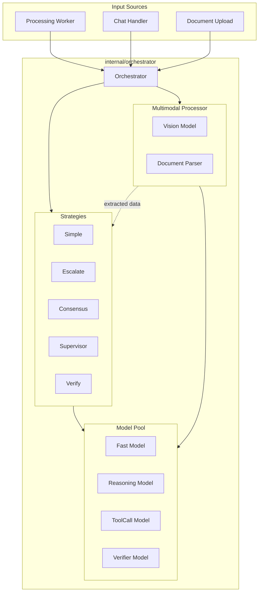
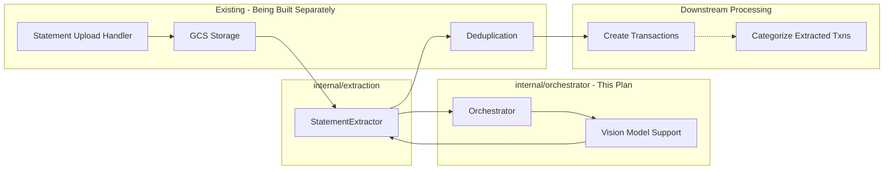

# Multi-Model Orchestrator

Replace `LLMRouter` with a unified `Orchestrator` supporting four collaboration strategies plus multimodal document processing.

## Overview

Replace the existing LLMRouter with a unified Orchestrator that supports four execution strategies (Escalate, Consensus, Supervisor, Verify) and provides multimodal model support. Integrates with existing statement extraction service.

## Todos

| # | ID | Description | Status |
|---|-----|-------------|--------|
| 1 | create-package | Create internal/orchestrator/ package with core types | pending |
| 2 | simple-strategy | Implement Simple strategy - port existing LLMRouter.Process logic | pending |
| 3 | escalate-strategy | Implement Escalate strategy - cheap model first, escalate low-confidence | pending |
| 4 | consensus-strategy | Implement Consensus strategy - parallel model calls with voting | pending |
| 5 | verify-strategy | Implement Verify strategy - generate/check/refine loop | pending |
| 6 | supervisor-strategy | Implement Supervisor strategy - planner + worker pattern | pending |
| 7 | multimodal-support | Add vision/multimodal model support for extraction service | pending |
| 8 | integrate-extraction | Refactor internal/extraction to use Orchestrator | pending |
| 9 | migrate-worker | Migrate processing.Worker to use Orchestrator | pending |
| 10 | migrate-chat | Migrate llm.ChatHandler to use Orchestrator | pending |
| 11 | config-options | Add new config options for strategies and model roles | pending |
| 12 | cleanup | Delete router.go, consolidate prompts, update imports | pending |

## Architecture



## Integration with Existing Statement Extraction

The orchestrator provides the **model abstraction layer** that the existing `internal/extraction` service uses. Statement upload, storage, and handlers are already being built separately (see `bank_statement_upload_and_transaction_extraction` plan).



**Key Integration Point**: The `StatementExtractor` in `internal/extraction/statement.go` will call `Orchestrator.Execute()` with `TaskTypeParseStatement` instead of making direct Gemini API calls.

## File Structure

```
internal/orchestrator/
├── orchestrator.go    # Core Orchestrator type, Execute method
├── config.go          # OrchestratorConfig, model pool setup
├── strategy.go        # Strategy interface and enum
├── simple.go          # StrategySimple (current behavior)
├── escalate.go        # StrategyEscalate (cheap -> expensive)
├── consensus.go       # StrategyConsensus (multi-model voting)
├── supervisor.go      # StrategySupervisor (planner + workers)
├── verify.go          # StrategyVerify (generate -> check -> refine)
├── multimodal.go      # Multimodal document/image/video processing
├── model.go           # ModelSpec, provider clients, API calls
├── task.go            # Task, Result types
└── prompts.go         # Move prompts from processing/llm.go
```

## Implementation

### 1. Core Types (internal/orchestrator/orchestrator.go)

```go
type ModelRole string
const (
    RoleFast      ModelRole = "fast"      // Quick, cheap responses
    RoleReasoning ModelRole = "reasoning" // Deep thinking, complex tasks
    RoleToolCall  ModelRole = "tool_call" // Function calling capable
    RoleVerifier  ModelRole = "verifier"  // Checks other models' work
    RoleVision    ModelRole = "vision"    // Multimodal: images, PDFs, video
    RolePlanner   ModelRole = "planner"   // Supervisor strategy: task decomposition
)

type Orchestrator struct {
    models     map[ModelRole]*ModelSpec
    config     *Config
    client     *http.Client
    multimodal *MultimodalProcessor  // For document/image/video tasks
}

type Config struct {
    DefaultStrategy      Strategy
    EscalateThreshold    float64  // 0.85 default
    ConsensusRequired    int      // 2 default  
    MaxVerifyIterations  int      // 3 default
    TimeoutPerModel      time.Duration
    
    // Multimodal settings
    MaxImageSize    int64         // 20MB default
    MaxVideoLength  time.Duration // 5min default
    MaxPDFPages     int           // 50 default
    OCRFallback     bool          // true default
}

func (o *Orchestrator) Execute(ctx context.Context, task *Task) (*Result, error)
func (o *Orchestrator) IsConfigured() bool
func (o *Orchestrator) SupportsVision() bool  // Check if vision model configured
```

### 2. Task/Result Types (internal/orchestrator/task.go)

```go
type TaskType string
const (
    TaskTypeCategorize    TaskType = "categorize"
    TaskTypeCategorizeP2P TaskType = "categorize_p2p"
    TaskTypeChat          TaskType = "chat"
    // Vision tasks are handled via CallVision() directly by extraction service
)

type Task struct {
    ID       string
    Type     TaskType
    Strategy Strategy  // Override default
    Input    any       // []TransactionContext, ChatMessage, etc.
    Context  *TaskContext
}

type Result struct {
    Output      any       // []LLMResult, ChatResponse, etc.
    Confidence  float64
    ModelPath   []string  // Which models were used
    Escalated   bool
    Iterations  int
}
```

Note: Document extraction types (`ExtractedTransaction`, etc.) are already defined in `internal/extraction/statement.go` as part of the statement upload plan.

### 3. Strategy Implementations (minimal viable versions)

**Simple** (internal/orchestrator/simple.go) - Current behavior, single model call

**Escalate** (internal/orchestrator/escalate.go):

- Call fast model first
- Check confidence in results
- If any result < threshold, re-process those with reasoning model
- ~50 lines of code

**Consensus** (internal/orchestrator/consensus.go):

- Call 2-3 models in parallel (goroutines)
- Compare results, use majority vote on category
- Return highest-confidence result from winning category
- ~70 lines of code

**Supervisor** (internal/orchestrator/supervisor.go):

- Planner model breaks complex request into subtasks
- Worker models execute subtasks in parallel
- Planner synthesizes results
- ~100 lines of code (mostly for chat, minimal for categorization)

**Verify** (internal/orchestrator/verify.go):

- Generate with fast model
- Verify with different model (check for errors)
- If issues found, refine with feedback
- Max 3 iterations
- ~80 lines of code

### 4. Multimodal Support (internal/orchestrator/multimodal.go)

The orchestrator provides **vision model abstraction** that the existing `internal/extraction` service uses. Upload handlers, storage, and deduplication are handled by the separate statement extraction plan.

**Supported Models** (vision/multimodal capable):

- Google Gemini 2.0/2.5/3 Pro (images, PDFs, video, audio) - **primary**
- OpenAI GPT-4o (images) - fallback
- Anthropic Claude 3.5 (images, PDFs) - fallback

**Core Vision API**:

```go
// multimodal.go - Provides vision model calls for extraction service

type VisionRequest struct {
    Prompt   string   // The extraction prompt
    Document []byte   // Raw file bytes (PDF, image)
    MimeType string   // application/pdf, image/jpeg, etc.
}

type VisionResponse struct {
    Content    string  // Raw JSON response from model
    TokensUsed int
    Model      string  // Which model was used
}

// CallVision is the core method that extraction service uses
func (o *Orchestrator) CallVision(ctx context.Context, req *VisionRequest) (*VisionResponse, error) {
    model := o.models[RoleVision]
    if model == nil {
        return nil, fmt.Errorf("no vision model configured")
    }
    
    // Build multimodal message for OpenAI-compatible API
    // Gemini, GPT-4o, and Claude all support this format
    messages := []Message{
        {
            Role: "user",
            Content: []ContentPart{
                {Type: "text", Text: req.Prompt},
                {Type: "image_url", ImageURL: &ImageURL{
                    URL: fmt.Sprintf("data:%s;base64,%s", req.MimeType, base64.StdEncoding.EncodeToString(req.Document)),
                }},
            },
        },
    }
    
    return o.callModelWithVision(ctx, model, messages)
}
```

**Integration with Existing Extraction Service**:

The `StatementExtractor` in `internal/extraction/statement.go` will be refactored to use the orchestrator:

```go
// internal/extraction/statement.go - EXISTING FILE, will be modified

type StatementExtractor struct {
    orchestrator *orchestrator.Orchestrator  // NEW: use orchestrator instead of direct Gemini
    // ... existing fields
}

func (e *StatementExtractor) ExtractTransactions(ctx context.Context, data []byte, mimeType string, accountType models.AccountType) ([]ExtractedTransaction, error) {
    prompt := buildExtractionPrompt(accountType)
    
    // Use orchestrator for vision call (replaces direct Gemini call)
    resp, err := e.orchestrator.CallVision(ctx, &orchestrator.VisionRequest{
        Prompt:   prompt,
        Document: data,
        MimeType: mimeType,
    })
    if err != nil {
        return nil, err
    }
    
    return parseTransactionResponse(resp.Content)
}
```

**Benefits of Integration**:

- Extraction service gains fallback support (Gemini -> GPT-4o -> Claude)
- Consistent model configuration across all LLM usage
- Future: can apply Verify strategy to extraction for higher accuracy
- Future: can use Consensus strategy for important statements

### 5. Migration Path

**Worker** (internal/processing/worker.go):

```go
// Before
llmRouter *LLMRouter
results, err := w.llmRouter.Process(ctx, contexts, tags, rules, ...)

// After  
orchestrator *orchestrator.Orchestrator
result, err := w.orchestrator.Execute(ctx, &orchestrator.Task{
    Type:     orchestrator.TaskTypeCategorize,
    Strategy: orchestrator.StrategyEscalate,  // or from config
    Input:    &orchestrator.CategorizeInput{Transactions: contexts, Tags: tags, Rules: rules},
})
```

**ChatHandler** (internal/llm/handler.go):

```go
// Before: direct API calls in processChat()

// After
result, err := h.orchestrator.Execute(ctx, &orchestrator.Task{
    Type:     orchestrator.TaskTypeChat,
    Strategy: orchestrator.StrategySupervisor,  // for complex queries
    Input:    &orchestrator.ChatInput{Messages: messages, Context: convCtx},
})
```

### 6. Config Changes (internal/config/config.go)

New environment variables:

```bash
# Strategy selection
LLM_DEFAULT_STRATEGY=escalate    # simple|escalate|consensus|supervisor|verify

# Model roles (extend existing)
LLM_FAST_MODEL=google/gemini-2.0-flash
LLM_VERIFIER_MODEL=groq/llama-3.3-70b
LLM_VISION_MODEL=google/gemini-2.0-flash  # Must support vision/multimodal

# Strategy parameters
LLM_ESCALATE_THRESHOLD=0.85
LLM_CONSENSUS_REQUIRED=2
LLM_MAX_VERIFY_ITERATIONS=3

# Multimodal settings
LLM_VISION_MAX_IMAGE_SIZE=20971520    # 20MB
LLM_VISION_MAX_VIDEO_SECONDS=300      # 5 minutes
LLM_VISION_MAX_PDF_PAGES=50
LLM_VISION_OCR_FALLBACK=true          # Use OCR if vision fails

# OpenAI for GPT-4o vision (optional alternative)
OPENAI_API_KEY=sk-...
```

### 7. Files to Delete

- `internal/processing/router.go` - Replaced by orchestrator
- Move prompts from `internal/processing/llm.go` to orchestrator/prompts.go
- Keep `LLMClient` in llm.go temporarily for backward compat (mark deprecated)

## Execution Order

1. Create `internal/orchestrator/` package with core types
2. Implement Simple strategy (port existing router logic)
3. Implement Escalate strategy
4. Implement Consensus strategy  
5. Implement Verify strategy
6. Implement Supervisor strategy
7. Add vision/multimodal model support (`CallVision` method)
8. Refactor `internal/extraction` to use Orchestrator (integrates with existing statement upload work)
9. Migrate Worker to use Orchestrator
10. Migrate ChatHandler to use Orchestrator
11. Add new config options
12. Delete old router.go
13. Update tests

## Testing Strategy

- Unit tests for each strategy in isolation
- Integration test: process same transactions with different strategies, compare results
- Verify cost/latency tradeoffs with real API calls
- Vision model tests:
  - Verify `CallVision` works with Gemini, GPT-4o, Claude
  - Test fallback when primary vision model fails

## Integration with Statement Extraction Plan

The statement extraction plan (`bank_statement_upload_and_transaction_extraction`) handles:

- Database migration for statement_uploads (completed)
- GCS storage with RBAC (completed)
- StatementUpload model (completed)
- Extraction service with Gemini (completed - will be refactored to use orchestrator)
- Deduplication logic (completed)
- Upload handlers and UI (completed)

This orchestrator plan provides:

- Model abstraction layer that extraction service will use
- Fallback support across vision models
- Future: strategies (Verify, Consensus) for high-accuracy extraction

**After both plans complete**: Statement extraction will use `orchestrator.CallVision()` instead of direct Gemini calls, gaining fallback support and consistent configuration.
